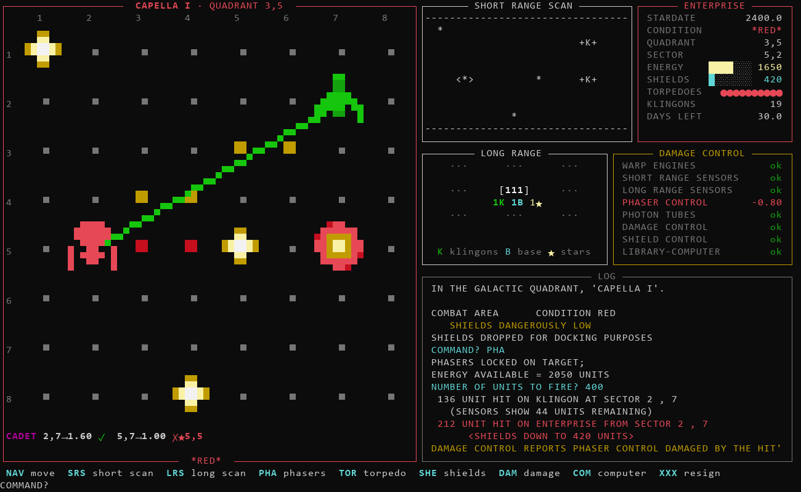
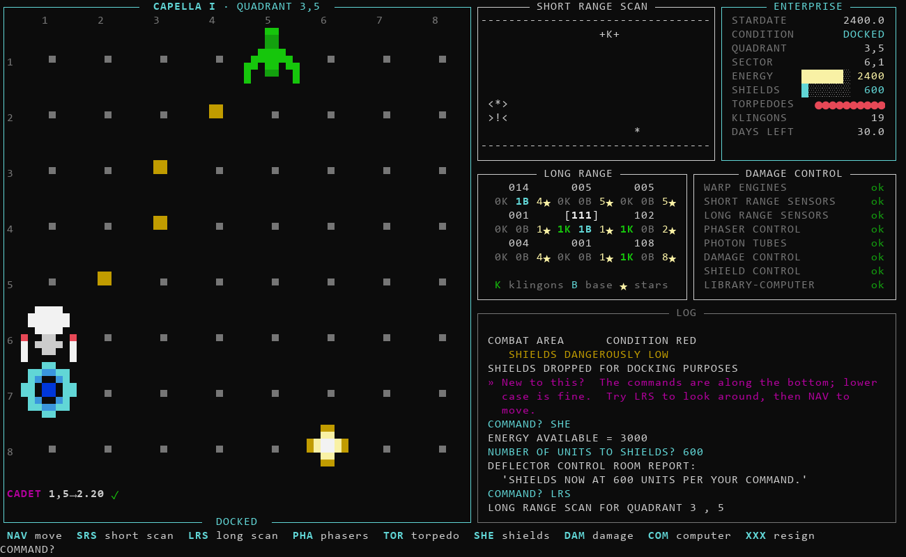
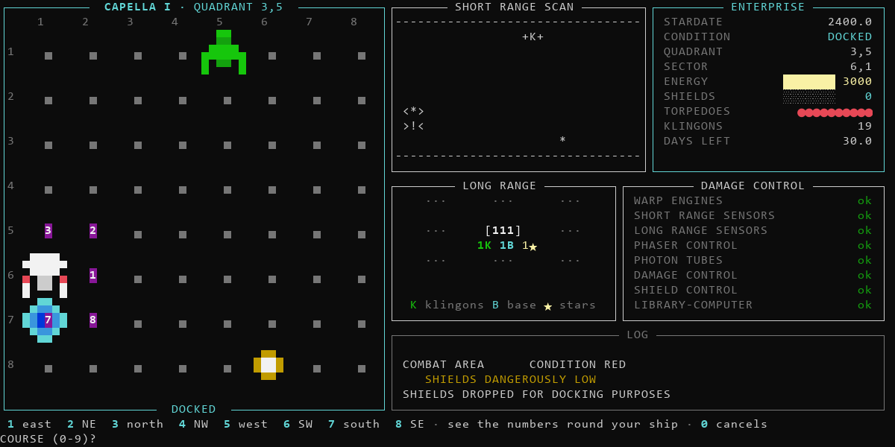
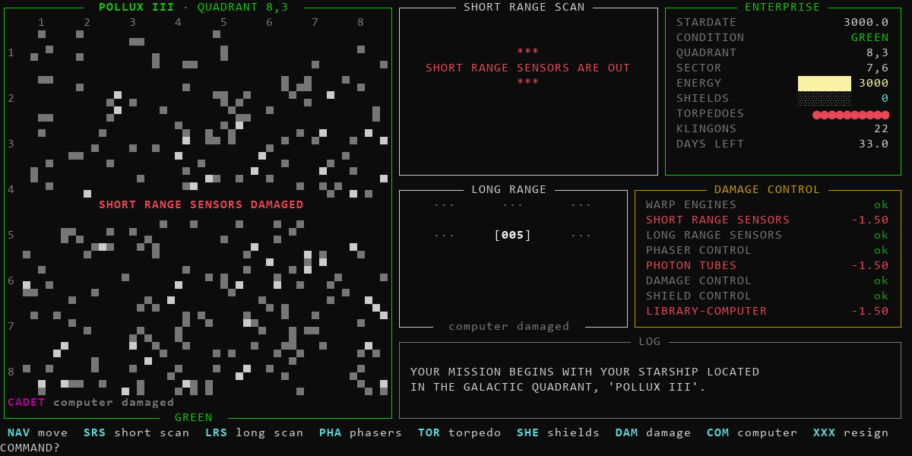
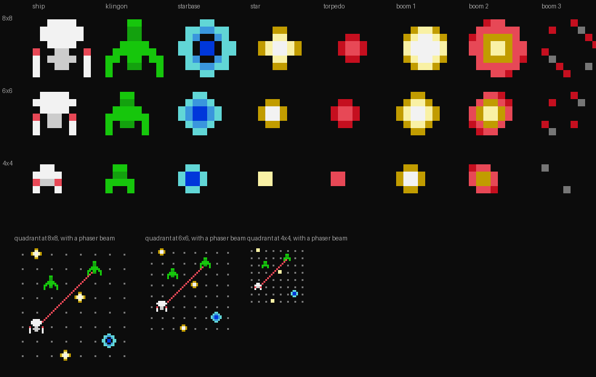

# Super Star Trek

A faithful Python transliteration of `SUPERSTARTREK.BAS` — the listing printed
in David Ahl's *BASIC Computer Games* (Microcomputer Edition, 1978), the book
that put this game on every TRS-80, Apple ][ and PET in the English-speaking
world — plus a split-screen front end that keeps the original's rules exactly.

Original by Mike Mayfield (1971, on a Sigma 7 at UC Irvine), reworked by Bob
Leedom at Westinghouse (1974, on a Data General Nova 800), converted to
Microsoft 8K BASIC by John Gorders (1978).



*A staged combat frame: a Klingon disruptor hits the Enterprise (flashing
red) while another Klingon explodes. Cadet mode, bottom left, shows a clear
course to 2,7 and a shot to 5,7 that a star would absorb.*

### Documents

| | |
|---|---|
| [docs/DESIGN.md](docs/DESIGN.md) | How it's built and why — the architecture, and every design decision with its reasoning |
| [docs/HISTORY.md](docs/HISTORY.md) | Where the game came from, which version this is, the research, and the 5×5 mystery |
| [BUGS.md](BUGS.md) | Bugs in the 1978 listing, what was preserved or guarded, this port's own errata, and what outside sources confirmed |

---

## Two ways to play

**The 1978 teletype**, exactly as it was — scrolling text, `print` and
`input`, no dependencies:

```
python -m trek
```

**The split screen**, which needs [`rich`](https://github.com/Textualize/rich)
(`pip install -r requirements.txt`):

```
python -m trek --ui
python -m trek --cadet            the split screen with the targeting assist
```

It wants a big window. `.\trek.cmd` opens Windows Terminal at 130×40 and
starts it for you; by hand, that's

```powershell
wt -w new --size 130,40 -d . pwsh
```

Other options, for either mode:

```
--seed 42                  a reproducible galaxy
--fix-starbase-count       repair the 1978 B9 bug (see BUGS.md)
--sprites 4|6|8            force a sprite size (default: largest that fits)
--no-anim                  no torpedo, phaser or explosion animation
--no-hints                 hide the command bar, prompt hints and course compass
```

---

## Commands

| | |
|---|---|
| `NAV` | set course (1–9) and warp factor |
| `SRS` | short range sensor scan |
| `LRS` | long range sensor scan |
| `PHA` | fire phasers |
| `TOR` | fire photon torpedoes |
| `SHE` | raise or lower shields |
| `DAM` | damage control report |
| `COM` | library computer: `0` galactic record, `1` status, `2` torpedo data, `3` starbase data, `4` direction calculator, `5` region map |
| `XXX` | resign your command |

**Course** is a compass where **1 is east and the numbers run
counterclockwise** — 3 north, 5 west, 7 south. Fractional courses work and
interpolate between the two nearest headings.

```
        4   3   2
          \ | /
      5 ---<*>--- 1
          / | \
        6   7   8
```

**Long range scans** report each quadrant as a three-digit number: klingons,
starbases, stars. `107` is one klingon, no starbase, seven stars. This is not
a display choice — it is literally how the galaxy is stored, one integer per
quadrant, and the opacity is load-bearing difficulty.

**Docking** (park adjacent to a `>!<`) refills energy and torpedoes and drops
your shields. It does **not** repair damage — that costs stardates, via `DAM`,
and only while docked.

### Things the instructions never tell you

All verified against the listing, with tests to prove them:

- **A torpedo hit always kills.** There is no strength check (lines
  5060–5110). Phaser damage falls off with distance, so a far-off Klingon can
  need more energy than the ship even carries.
- **`COM 2` then `TOR` never misses a clear shot.** The computer's bearing is
  the exact inverse of the torpedo's course interpolation. The only thing that
  stops it is something in the way — usually a star.
- **Crossing into a new quadrant costs one stardate, at any warp.** Warp 8
  across the galaxy costs the same day as warp 1 next door; only the energy
  differs. Docking refills energy, so the scarce resource is the number of
  hops, not their length.
- **Firing draws return fire; raising shields and arriving do not.** So shields
  go up *before* you shoot, and you always get the first strike.
- **You can win in overtime.** Crossing a quadrant can carry you past the
  deadline without ending the game — see BUGS.md #7.

---

## The split screen



The pixel quadrant is on the left, and the original ASCII scan sits beside it,
untouched. Then the ship's status, the long range chart, damage control, and
the canon teletype output scrolling in the log — every typo intact.

### For beginners

The command names are the easy part — type anything the game doesn't
recognise and it lists them, exactly as in 1978. What stops people is the
*prompts*. So the split screen helps in three ways, all on by default
(`--no-hints` turns them off):

- **The command bar.** While the game waits for a command, the bottom line
  lists all nine.
- **Prompt hints.** When it asks for something else, the bar explains that
  prompt instead: that shields take the new *total* rather than an amount to
  add, that phaser energy splits between every Klingon and fades with
  distance, what each `COM` number does, that `0` cancels. Each hint is a rule
  of the 1978 game, checked against the engine with its line number beside it
  in [`trek/ui/hints.py`](trek/ui/hints.py).
- **The compass.** Whenever it asks for a course, the numbers 1–8 appear in
  the sectors around your ship, so you can see which way each one goes. They
  come from the engine's own course table, and a test flies one sector on
  every course to check the ship lands where its number was drawn.

A one-off welcome line in the log (in magenta — the UI speaking, not the 1978
game) suggests `LRS` then `NAV` to start.



### The fairness rule

The panels may only show what the original gives you for free, and each one
must break when the instrument behind it breaks.

`SRS`, `LRS` and `COM` cost no time and no energy, so keeping their results on
screen is just "auto-typing a free command" — it changes nothing about
difficulty. But:

| Damaged | Effect |
|---|---|
| short range sensors | the pixel view dissolves into static, and the ASCII scan goes dark |
| long range sensors | the long range panel says so |
| library computer | no decoding of `107`, no cadet assist |
| damage control | no damage report |

Ship-internal readouts — energy, shields, torpedoes, the clock — stay up.

The long range panel shows your **chart**, not the galaxy: it only fills in
where you have actually run `LRS`. So scanning is still something you have to
remember to do.



### Cadet mode

`--cadet` adds a targeting line under the quadrant. For every Klingon it shows
the course `COM 2` would give you, and then the one thing the original never
tells you: whether a torpedo on that course actually reaches it (`✓`, gold
track) or hits something first (`✗★5,5`, red track stopping at the star).

It is built from the engine's own `bearing()` and `torpedo_track()` — the
same code the real shot runs — so the preview cannot disagree with what
happens when you fire. The course is rounded to two decimals before the check,
so a tick means *type exactly this and it hits*. The computer does the sums,
so no computer, no cadet.

### Animation

Modest, and only where the original prints something anyway: the torpedo
flies its track, phasers and Klingon disruptors draw beams, the ship flashes
red when hit, and things explode in three frames. Nothing is animated when the
short range sensors are down, because you can't see it.

### Sprites



A first pass, and meant to be fiddled with. Every sprite is a list of strings
in [`trek/ui/sprites.py`](trek/ui/sprites.py), one per pixel row, using
palette letters (`W` white, `G` green, `R` red, `.` transparent …) — the 16
standard ANSI colours and nothing else, so it stays CGA-era.

Pixels are drawn with half-block characters, two per text cell, which comes
out roughly square. The screen picks the biggest size that fits:

| Sprites | Terminal |
|---|---|
| 8×8 | 130×40 — what `trek.cmd` opens |
| 6×6 | 120×30 — Windows Terminal's default |
| 4×4 | down to about 97×29 (97×28 with `--no-hints`) |

Smaller than that and it falls back to the teletype.

To see your edits without playing:

```
pip install pillow
python tools/sprite_sheet.py        -> sprites.png, every sprite at every size
python tools/screenshot.py          -> screenshot.png, a whole UI frame
```

---

## Layout

```
trek/
  config.py      every magic number from the listing, named, with line numbers
  basic.py       MS BASIC emulation: PRINT number formatting, INPUT
  names.py       quadrant region names (9030-9260)
  banner.py      the title banner (220-227)
  game.py        the engine
  __main__.py    entry point
  ui/
    app.py       the screen: wires the engine's seams to the terminal
    panels.py    one pure function per panel -- state in, drawing out
    canvas.py    pixels to half-block characters
    sprites.py   the sprites and the palette
    cadet.py     the targeting assist
    hints.py     the command bar and prompt hints
tests/
  test_engine.py   31 tests: rules, endings, bugs preserved, bearings
  test_ui.py       26 tests: layouts, panels, fairness, hints, the compass, whole games
tools/
  autoplay.py      a bot that plays the real engine, to test balance
  sprite_sheet.py  preview the sprites as a PNG
  screenshot.py    render a UI frame as a PNG
docs/
  DESIGN.md      architecture and design decisions
  HISTORY.md     the game's lineage and the research
  *.png          the pictures in this README
BUGS.md          what was preserved, what was guarded, and why
```

### Design notes

**The engine never calls `print()` or `input()`.** Output goes through `out`,
input through `ask_str` / `ask_num` / `ask_two`, and a third seam, `event`,
marks moments worth animating and brackets blocks of output (a scan, a table)
that the split screen shows in a panel instead of the log. The teletype
ignores events entirely. The split screen, the tests and the autoplay bot are
all just different things plugged into the same seams.

**The engine is pull-based, and that suits a screen UI.** It asks for input in
the middle of a command and waits, so every prompt is a natural moment to
redraw. No threads, no event loop: the engine stays in charge, exactly as it
does in the teletype. A full redraw takes about 11 ms, fast enough that
animation frames just redraw the whole screen.

**The quadrant is still a 192-character string.** Line 8670 stored the current
quadrant as a flat string, three characters per sector, rebuilt in full on
every write — there was no object model, and collision detection was literally
`MID$(Q$,S8,3) = "   "`. That is kept, both because it is the most
characterful thing in the program and because the panels read `game.q`
directly.

**Arrays are 1-based**, index 0 unused, so `K(I,3)` in the listing is
`self.k[i][3]` here. Every formula carries its originating BASIC line number
in a comment.

**Configurable, but only 8×8 is tested.** `config.py` names everything, and
`galaxy_size` / `sector_size` are separate constants — in the original they
were the *same* constant, because line 475's `FNR()` picked a random 1–8 and
was used for both quadrant and sector coordinates. Other values are untested
and the balance is tuned for 64 quadrants.

---

## Fidelity

The rule is **preserve, unless it makes the game unplayable**. Eight bugs from
the 1978 listing are catalogued in [BUGS.md](BUGS.md): six preserved, one
guarded against crashing, and one (`DEF FND` reading a global) restructured
with identical behaviour. The typos (`CONGRULATION`, `NAVAGATION`, `MAXIUM`,
`FDERATION`) are all intact.

BUGS.md also records where each finding was checked against outside sources,
and the mistakes this port made along the way and how they were fixed.

What is deliberately *not* reproduced is the random number generator. BASIC's
`RND` is not reproducible in any modern language — a TRS-80 and an Apple ][
running this same listing did not agree either. The formulas are copied
exactly; the numbers feeding them are Python's.

That means golden-transcript testing is impossible, so the tests check
structure and rules instead: that the base-10 encoding round-trips, that every
ending is reachable, that docking does not secretly repair your ship, that the
computer's bearing hits every target from every square.

```
python tests/test_engine.py
python tests/test_ui.py
python tools/autoplay.py 300
```

---

## Roadmap

- [x] **Phase 1** — the 1978 listing, scrolling teletype, `print`/`input`
- [x] **Phase 2** — split screen: pixel quadrant beside the ASCII scan, sprites
      at 4×4 / 6×6 / 8×8, a decoded long range chart, panels that fail with
      their instruments, opt-in cadet mode, modest animation
- [x] **Beginner aids** — command bar, prompt hints, compass round the ship
- [ ] Sprites, second pass
